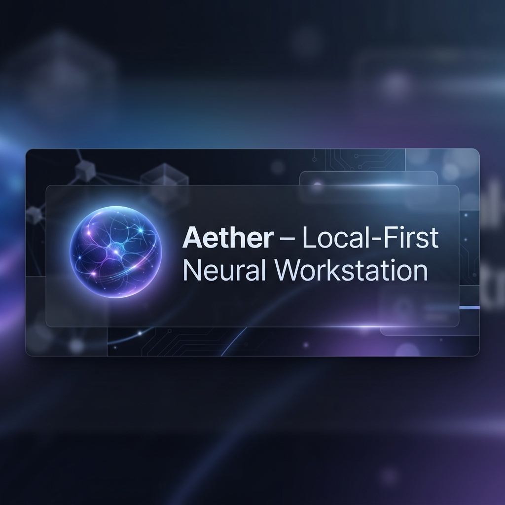
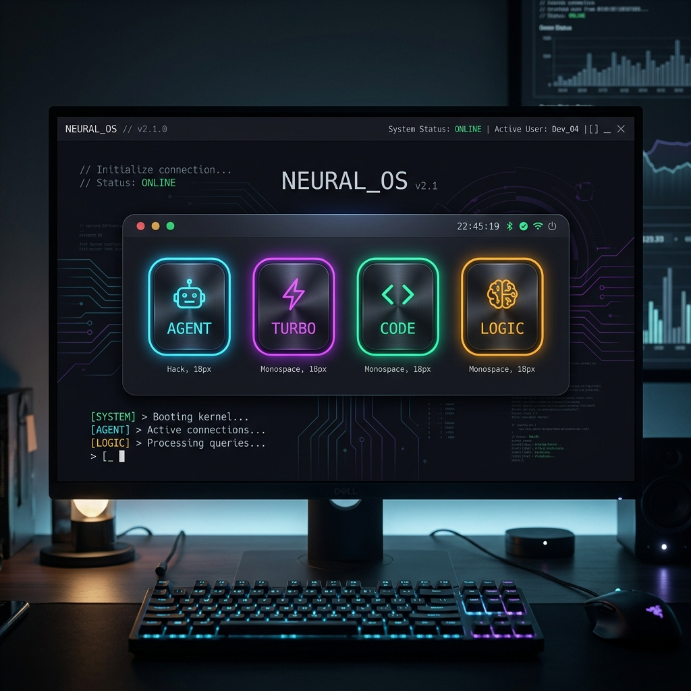
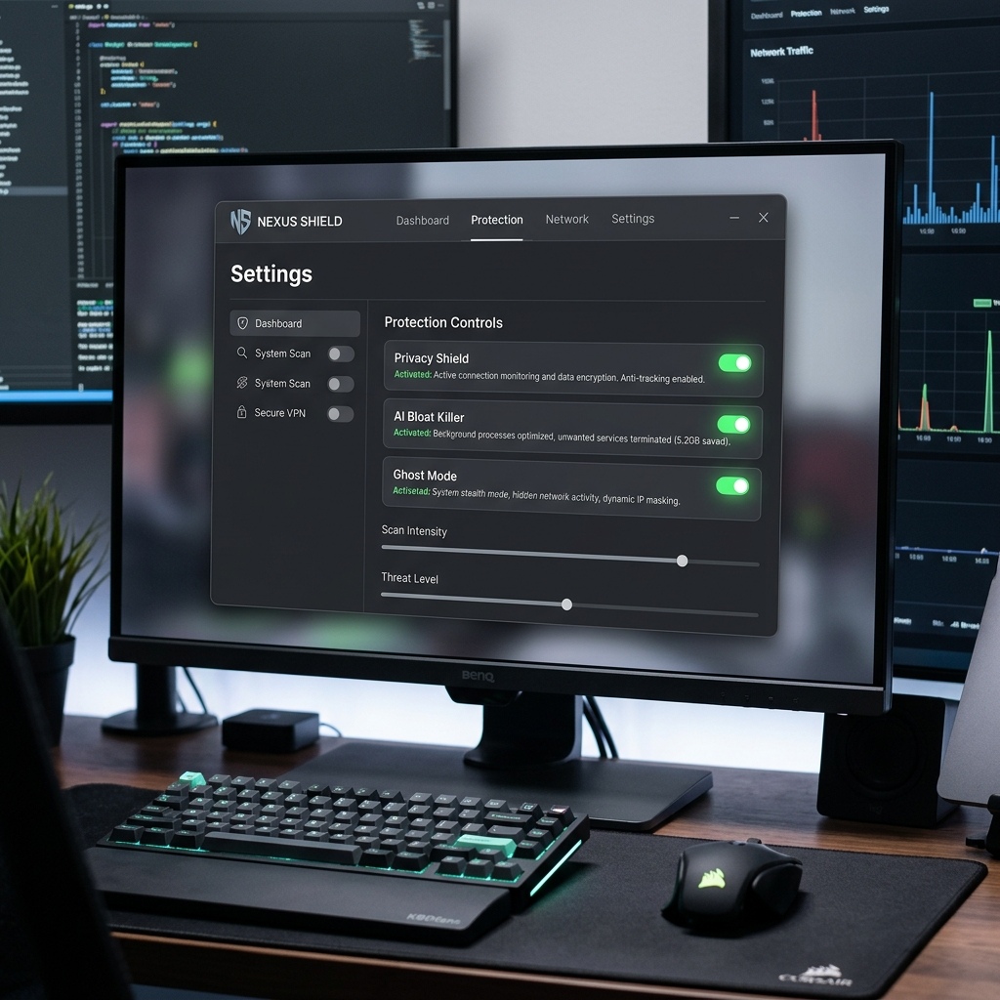
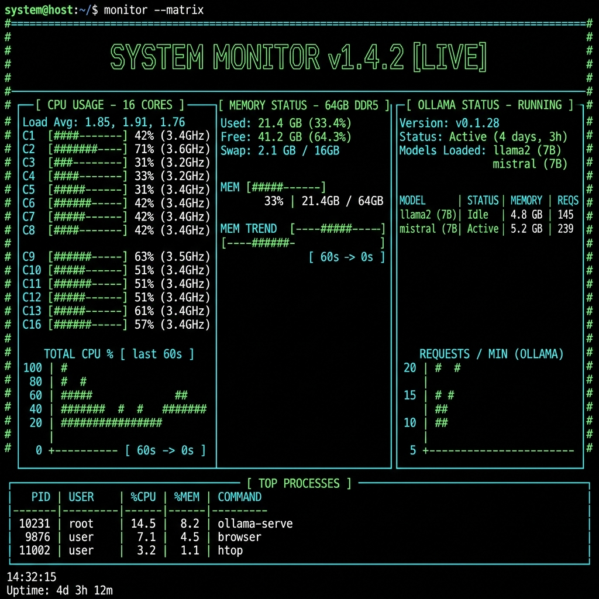

# 🧭 Aether Neural OS: The Master Guide

Welcome to the vanguard of local intelligence. Aether is not just a tool; it is your private, self-healing, and uncompromising neural workstation. This guide will take you from your first boot to advanced system orchestration.

---

## 🌓 The Philosophy: Local-First Sovereignty

  

In an era where "Big AI" treats your data as raw material for their corporate models, Aether stands as a fortress. 
- **Privacy as a Default:** Every thought, command, and file stays on your hardware.
- **Agency as a Feature:** Aether doesn't just talk; it *does*. It interacts with your OS, manages files, and heals itself.
- **Sovereignty as a Goal:** You own the weights. You own the logs. You own the future.

---

## 🚀 Phase 1: The Golden Path (First Contact)

### 1. The Onboarding Wizard
When you first launch Aether, our **Hardware Auditor** scans your system. It detects your VRAM, CPU cores, and memory bandwidth to suggest the optimal "Neural Pathways" (models).
- **Pro Tip:** If you have an Apple Silicon Mac or an NVIDIA GPU, Aether will automatically prioritize GPU acceleration for near-instant responses.

### 2. Selecting Your First Pathway
Aether uses specialized "Pathways" for different tasks. Don't use a hammer for a needle.

  

- **`AGENT` (The Generalist):** Use this for 90% of tasks. It's smart, tool-aware, and logical.
- **`TURBO` (The Speedster):** Best for quick questions, translations, or simple formatting.
- **`CODE` (The Engineer):** Optimized for deep architectural refactoring and bug hunting.
- **`LOGIC` (The Philosopher):** Uses Chain-of-Thought (CoT) reasoning for complex planning.

### 3. Your First Neural Query
Once in the terminal, try asking:
> "Analyze my local environment and tell me how I can optimize my workspace for maximum focus."

---

## 🧠 Phase 2: Mastering the AetherVault

Aether doesn't forget. While you chat, the **Shadow Monitor** (a background process) distills key facts about your preferences, projects, and style.

### How to use the Vault:
1. **Passive Learning:** You don't have to do anything. Just work. Aether saves "fragments" automatically.
2. **Manual Steering:** Open the Vault panel to view these fragments. You can edit them to correct Aether's memory or delete them if they are no longer relevant.
3. **Context Injection:** When you ask a question, Aether performs a local RAG (Retrieval-Augmented Generation) search across your Vault to bring relevant memories into the current conversation.

---

## 🛡️ Phase 3: The Nexus Shield & System Hardening

Aether is also a system optimizer. Use the **Nexus** panel to reclaim your hardware from "AI Bloat".

  

- **Telemetry Killer:** Forcefully disables OS-level tracking (like Windows Recall or macOS analytics) to free up VRAM.
- **Ghost Mode:** Encrypts your local logs and rotates your neural signatures for maximum anonymity.
- **Watchdog:** A continuous monitor that ensures your local LLM server (Ollama) and MCP links are healthy.

---

## 🛠️ Phase 4: Advanced Orchestration (MCP)

The **Model Context Protocol (MCP)** is how Aether connects to the world.
- **AetherFS:** Give your agent permission to read and write files in specific directories.
- **AetherSearch:** Plug in local search engines or web-scrapers to give your agent real-time knowledge without cloud dependencies.
- **Custom Skills:** You can "Sideload" custom Python scripts into the `toolbox/` folder. Aether will automatically discover them and add them to its list of available tools.

---

## 🆘 Troubleshooting & Support

  

- **Slow Responses?** Check the **Neural Monitor** ( `/health`). You might be running a model too large for your VRAM.
- **Connection Errors?** Ensure Ollama is running (`ollama serve`) and the `api_server.py` is active.
- **Memory Issues?** If Aether "forgets" something, try the `/memory` command to see what's currently in the active context window.

---

*“The best way to predict the open-source neural future is to build it.”*  
**Welcome to the Rebellion.**
