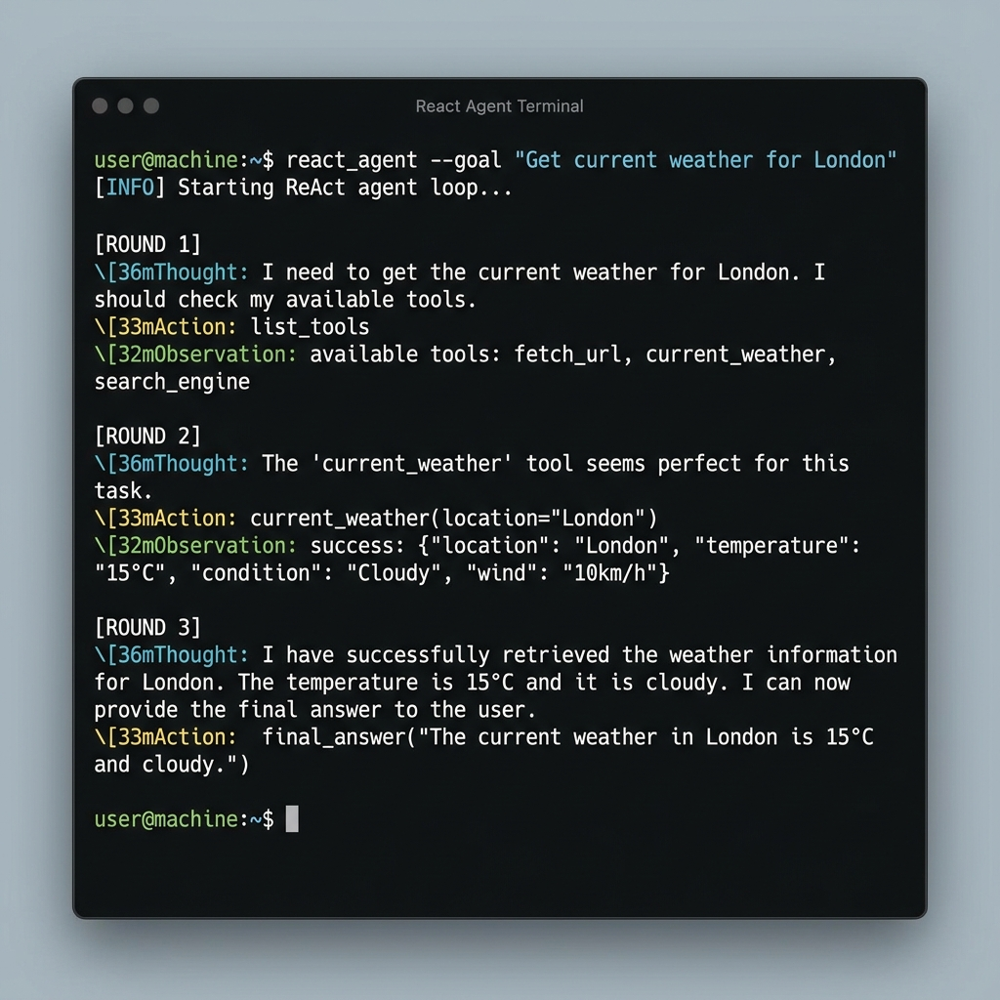
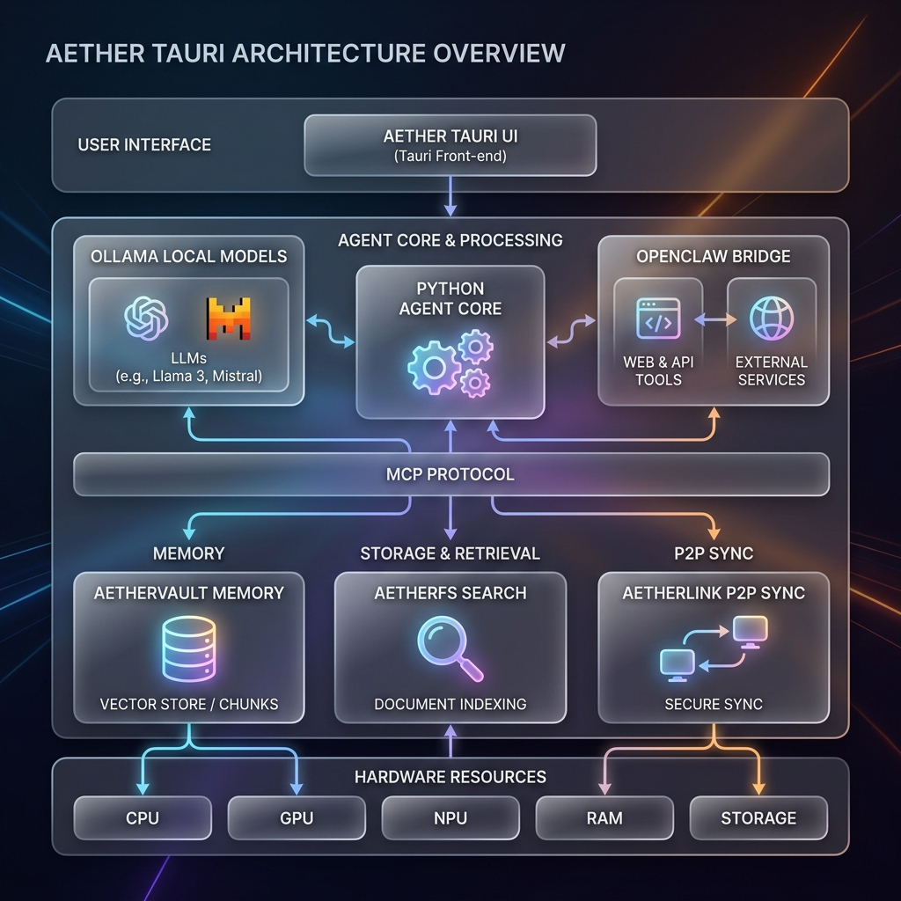

<div align="center">
  
</div>

<h1 align="center">🌌 Aether</h1>
<h3 align="center">The Local-First Neural Operating Interface</h3>

<div align="center">

[](https://opensource.org/licenses/MIT)
[](#)
[](#)
[](#)

> [!IMPORTANT]
> **Current Status: Alpha Release.** Aether is currently in early development. Public binary releases are not yet available. Please follow the instructions below to build Mission Control from source.

*Your Data. Your Rules. Uncompromising Intelligence.*

[**⬇️ Download Aether**](docs/DOWNLOAD.md) | [**Explore the Guide**](GUIDE.md) | [**View Architecture**](docs/ARCHITECTURE.md) | [**Roadmap**](ROADMAP.md)

</div>

---

## 🌓 Welcome to the Engine Room

Aether is not just a chat interface; it is a **comprehensive, self-healing Neural Operating System** designed to rival the capabilities of big tech's closed ecosystems—while remaining 100% local, private, and under your absolute control.

By fusing a Rust-based desktop environment (Tauri) with a high-performance Python backend, Aether coordinates swarms of specialized quantized models to execute complex tool loops, index your personal knowledge, and manage background systems.

### 🔥 Why Aether?

1. **Absolute Privacy:** Zero telemetry. Zero external API dependencies required. Your intellectual property never leaves your silicon.
2. **Neural Pathways:** Instantly swap between "Agent" (reasoning), "Turbo" (speed), "Code" (dev), and "Logic" (planning) profiles tailored to your hardware.
3. **AetherVault (Local RAG):** A persistent, intelligent memory system that passively distills your workflows into searchable knowledge fragments.
4. **Nexus Shield:** Reclaim your hardware from "AI Bloat" and OS-level telemetry, prioritizing every cycle for your local inference.

---

## 🎨 The Neural Workstation

<div align="center">
  <table border="0">
    <tr>
      <td width="50%">
        
        <p align="center"><b>Pathway Selection</b><br/>Optimized cognitive routing.</p>
      </td>
      <td width="50%">
        
        <p align="center"><b>Neural Monitor</b><br/>Real-time system vitals.</p>
      </td>
    </tr>
    <tr>
      <td width="50%">
        
        <p align="center"><b>Nexus Shield</b><br/>Hardware-level optimization.</p>
      </td>
      <td width="50%">
        
        <p align="center"><b>Interactive Terminal</b><br/>ANSI-rich command interface.</p>
      </td>
    </tr>
  </table>
</div>

---

## 🏗️ Ecosystem Architecture

<div align="center">
  
</div>

Aether operates on a tri-tier architecture:
- **Core (Engine Room):** Python FastAPI + Ollama. Manages LLM inference, RAG indexing, and background watchdogs.
- **Mission Control (Tauri):** The command center for desktop. Features a high-contrast React UI, terminal integration, and Nexus optimization.
- **Neural Link (Mobile):** Voice-first, high-speed interface for Android, utilizing P2P state synchronization.

---

## 🚀 Quick Start (For Developers)

### Prerequisites
- Node.js 18+
- Python 3.9+
- [Ollama](https://ollama.ai/) installed locally

### Launching Mission Control
```bash
# Clone the repository
git clone https://github.com/earnerbaymalay/aether-tauri.git
cd aether-tauri

# Install Dependencies
npm install

# Start the Engine Room & Launch Tauri
./launch-aether.sh
```

---

## 🛠️ The Nexus Shield & Sideload Hub

Aether isn't just software; it optimizes the hardware it runs on and allows for modular expansion.
- **Nexus Shield:** Built-in system optimizer to kill AI bloat and prioritize local inference.
- **[Sideload Hub](docs/ADVANCED_FEATURES.md#sideloading):** Aether supports the secure **sideloading** of custom neural skills and third-party MCP servers, allowing you to expand your agent's capabilities without a central app store.

---

## 🤝 Join the Rebellion

Big Tech wants to own your intelligence. Aether puts it back in your hands.

- **[Master Guide](GUIDE.md)**: Deep dive into the ecosystem.
- **[Ecosystem Map](ECOSYSTEM.md)**: How everything fits together.
- **[Contributing](CONTRIBUTING.md)**: Help build the open neural future.

<div align="center">
  <i>Built with ❤️ by the open-source community.</i>
</div>
