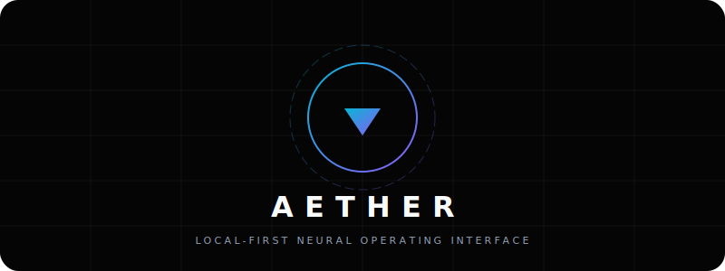
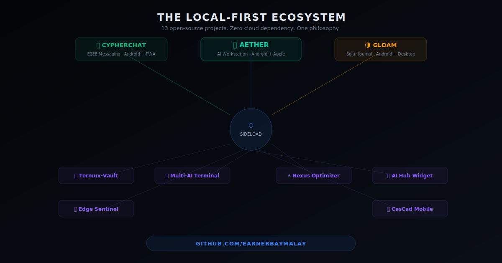

<div align="center">
  
</div>

<h1 align="center">Aether</h1>
<h3 align="center">The Local-First Neural Operating Interface</h3>

<div align="center">
  
[](https://opensource.org/licenses/MIT)
[](#)
[](#)

*Your Data. Your Rules. Uncompromising Intelligence.*

</div>

---

## 🌌 Welcome to the Engine Room

Aether is not just a chat interface; it is a **comprehensive, self-healing Neural Operating System** designed to rival the capabilities of big tech's closed ecosystems—while remaining 100% local, private, and under your absolute control.

By fusing a Rust-based desktop environment (Tauri) with a high-performance Python FastAPI backend, Aether coordinates swarms of specialized quantized models (via Ollama/llama.cpp) to execute complex tool loops, index your personal knowledge, and manage background systems.

### 🔥 Why Aether?

The era of shipping your intellectual property to corporate servers is over. Aether provides:

1. **Absolute Privacy:** Zero telemetry. Zero external API dependencies required. Your data never leaves your machine.
2. **Specialized Neural Pathways:** Instantly swap between "Agent" (deep reasoning), "Turbo" (speed), "Code" (development), and "Logic" (planning) profiles tailored to your hardware.
3. **AetherVault (Local RAG):** A persistent, intelligent memory system. Aether passively distills conversations into Markdown fragments, making it smarter about *you* over time.
4. **Self-Healing Architecture:** A continuous background watchdog monitors the health of the neural links and MCP (Model Context Protocol) servers, auto-recovering from failures.
5. **Universal Compatibility:** Works seamlessly across macOS (Mission Control) and Android/Linux (Neural Link) with built-in P2P state synchronization.

---

## 📐 Ecosystem Architecture

<div align="center">
  
</div>

Aether operates on a tri-tier architecture:
- **Core (Engine Room):** Python FastAPI + Ollama. Manages the LLM inference, RAG indexing, and background watchdogs.
- **Mission Control (Tauri):** The command center for desktop. Features a high-contrast React UI, terminal integration, and local system optimization tools (Nexus Shield).
- **Neural Link (Mobile):** Voice-first, high-speed interface for Android, utilizing Zeroconf to sync state directly to your desktop.

---

## 🚀 Quick Start (Zero to Intelligence in 60s)

Aether features a guided onboarding wizard that automatically audits your hardware and suggests the optimal neural weights.

### Prerequisites
- Node.js 18+
- Python 3.9+
- [Ollama](https://ollama.ai/) installed locally

### Launching Mission Control
```bash
# Clone the repository
git clone https://github.com/earnerbaymalay/aether-tauri.git
cd aether-tauri

# Install Frontend Dependencies
npm install

# Start the Engine Room (Core API)
python3 api_server.py &

# Launch the Tauri App
npm run tauri dev
```

---

## 🛠️ The Nexus Shield & Sideload Hub

Aether isn't just software; it optimizes the hardware it runs on.
- **Nexus Shield:** Built-in system optimizer to kill AI bloat and prioritize local inference.
- **Sideload Hub:** Aether supports the secure **sideloading** of custom neural skills and third-party MCP servers, allowing you to expand your agent's capabilities without a central app store.

---

## 🤝 Join the Rebellion

Big Tech wants to own your intelligence. Aether puts it back in your hands.

Read our [Ecosystem Guide](ECOSYSTEM.md) for deep dives into our MCP toolsets, or check the [Contributing Guidelines](CONTRIBUTING.md) to help build the open-source neural future.

<div align="center">
  <i>Built with ❤️ by the open-source community.</i>
</div>
