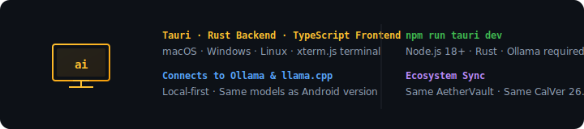

<div align="center">

# 🖥️ A E T H E R — D E S K T O P
### *Local AI for macOS, Windows & Linux.*

[](VERSIONS.md)
[](https://tauri.app/)
[](LICENSE)

**[📲 Download](https://github.com/earnerbaymalay/aether-desktop/releases)** · **[🌐 Sideload Hub](https://earnerbaymalay.github.io/sideload/)** · **[📖 Usage Guide](USAGE.md)** · **[🔧 Troubleshooting](TROUBLESHOOTING.md)**

</div>

---



## What is Aether Desktop?

**Cross-platform desktop app connecting to local AI models (Ollama, llama.cpp) through a terminal-style interface.** Built with Tauri (Rust backend + TypeScript frontend via xterm.js). Same local-first approach as Android and Apple versions.

---

## Quick Start

### Requirements

- Node.js 18+
- Rust
- Ollama running locally

### Build & Run

```bash
git clone https://github.com/earnerbaymalay/aether-desktop.git
cd aether-desktop
npm install
npm run tauri dev
```

### Use

1. Start Ollama: `ollama serve`
2. Pull a model: `ollama pull llama3.2`
3. Configure endpoint in Aether Desktop settings

### Production Build

```bash
npm run tauri build
```

---

## Architecture

```
aether-desktop/
├── src-tauri/              # Rust backend
│   ├── src/main.rs
│   ├── Cargo.toml
│   └── tauri.conf.json
├── src/                    # TypeScript frontend
│   ├── main.ts
│   ├── components/
│   └── styles/
├── index.html
├── package.json
└── vite.config.ts
```

---

## All Aether Platforms

<div align="center">

| Platform | Repository | Version |
|----------|------------|---------|
| 📱 **Android** | [aether](https://github.com/earnerbaymalay/aether) | 26.04.2 |
| 🖥️ **macOS / iPad** | [aether-apple](https://github.com/earnerbaymalay/aether-apple) | 26.04.2 |
| 🖥️ **Desktop** | [aether-desktop](https://github.com/earnerbaymalay/aether-desktop) | 26.04.2 |
| 📲 **Sideload Hub** | [sideload](https://earnerbaymalay.github.io/sideload/) | Live |

</div>

---

## Documentation

- **[📖 Usage Guide](USAGE.md)** — Setup, configuration, connecting to models.
- **[🔧 Troubleshooting](TROUBLESHOOTING.md)** — Tauri build errors, connection issues.

---

[MIT License](LICENSE)
